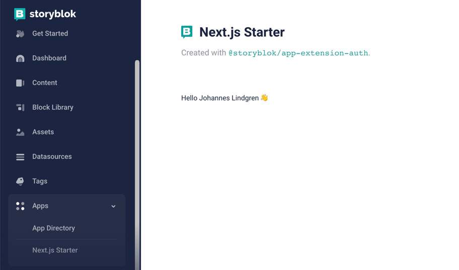

# Storyblok App Starter with Next.js

This is a starter template for Storyblok apps, created with Next.js and [@storyblok/app-extension-auth](https://www.npmjs.com/package/@storyblok/app-extension-auth).

## How to run

Install dependencies with

```shell
yarn install
```

Set up a secure tunnel to proxy your request to/from `localhost:3000`, for example with [ngrok](https://ngrok.com/):

```shell
ngrok http 3000
```

Note down your assigned URL; this will be your `baseUrl` for the application.

Create an app in Storyblok's Partner Portal and configure the following properties with the values derived from your `baseUrl`:

* **URL to your app**: `{baseUrl}`
* **OAuth2 callback URL**: `{baseUrl}/api/authenticate/storyblok/callback`

Rename the file `.env.local.example` to `.env.local`. Open the file and set the environmental variables:

* `CLIENT_ID`: the client id from the app settings page.
* `CLIENT_SECRET`: the client secret from the app settings page.
* `BASE_URL`: The `baseUrl` from your secure tunnel.

Start the application with

```shell
yarn dev
```

Finally, install the application to your space, open it from the sidebar and grant the app access when you're prompted. The result will be something like this:



## See Also

* Read more about [@storyblok/app-extension-auth](https://www.npmjs.com/package/@storyblok/app-extension-auth).
* Use [MUI](https://mui.com/) with [@storyblok/mui](https://www.npmjs.com/package/@storyblok/mui)
* Add linting with [eslint](https://www.npmjs.com/package/eslint).